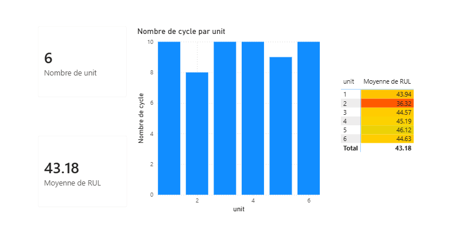
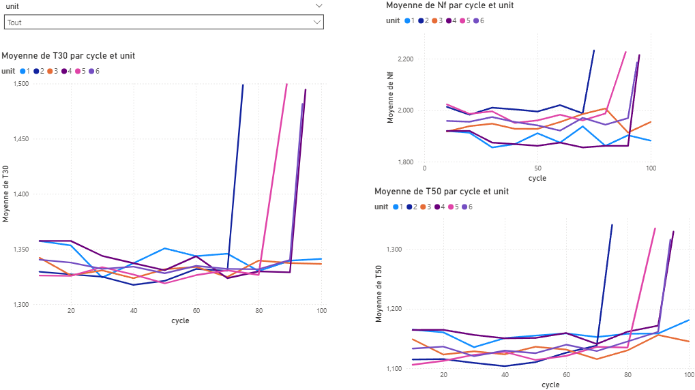
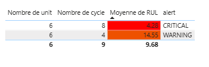

## 📈 Dashboard — 3 pages

### Page 1 — Vue d'ensemble de la flotte
- Nombre total de moteurs actifs (KPI card)
- Moyenne du RUL de la flotte (KPI card)
- Distribution des cycles par moteur (histogramme)
- Matrice d'alertes RUL avec mise en forme conditionnelle

### Page 2 — Détail moteur
- Évolution des capteurs T30, T50, Nf au fil des cycles
- Filtre interactif par numéro de moteur (segment)
- Détection visuelle de la dégradation

### Page 3 — Alertes critiques
- Table des moteurs en zone critique (RUL < 20)
- Code couleur : Rouge (CRITICAL) / Orange (WARNING)

## 🚨 Niveaux d'alerte RUL

| Niveau | RUL | Couleur |
|--------|-----|---------|
| OK | > 30 | 🟢 Vert |
| WATCH | 20–30 | 🟡 Jaune |
| WARNING | 10–20 | 🟠 Orange |
| CRITICAL | < 10 | 🔴 Rouge |

## 📸 Screenshots

### Page 1 — Vue d'ensemble


### Page 2 — Détail moteur


### Page 3 — Alertes


## ▶️ Comment reproduire ce projet

**1. Cloner le repo**
```bash
git clone https://github.com/SafaeELHARTI/NASA_CMAPSS.git
```

**2. Générer les données**
- Ouvrir le notebook `data_preparation.ipynb` sur Kaggle Notebooks
- Attacher le dataset NASA CMAPSS
- Exécuter toutes les cellules
- Télécharger le fichier `engine_monitoring.csv` généré

**3. Ouvrir le dashboard**
- Ouvrir Power BI Desktop
- `Fichier → Ouvrir` → sélectionner `fleet_dashboard.pbix`
- Pointer vers le fichier `engine_monitoring.csv` local

## 👤 Auteur

**Safae EL HARTI**  
[LinkedIn](https://linkedin.com/in/safa-el-khaoui) · [GitHub](https://github.com/SafaeELHARTI)
